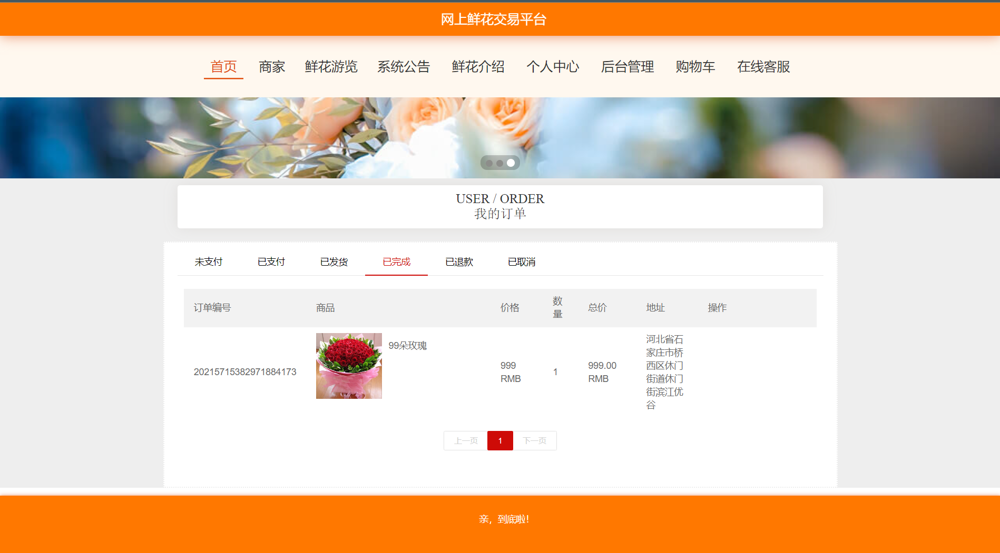

## 介绍
基于SpringBoot+Vue的鲜花商城、鲜花销售系统、在线鲜花商城、花店，前后端分离，毕业设计。

- 开发语言：Java 
- 数据库：mysql 
- 技术：SpringBoot+MyBatis+Vue 
- 工具：IDEA/Ecilpse+mysql+Navicat 
- Q: 3270728362
  
---

本系统分为**用户**、**店家**和**管理员**三种角色 

- 用户模块主要功能包括：登录/注册、主页浏览、**商家店铺**浏览、评论浏览、发表评论、鲜花浏览、可以按花店、花名、用途、**花语**进行查询、查看系统公告、查看**鲜花介绍**（花语）、修改个人资料、查看订单、编辑**收货地址**、**收藏**鲜花和查看收藏、购买鲜花、查看**购物车**。 
- 商家模块主要功能包括：修改密码、修改商家信息、查看评论、新增鲜花商品。 
- 管理员模块主要功能包括：修改密码和用户名、用户管理、商家管理（新增商家和删除商家）、设置鲜花分类、设置鲜花浏览、公告管理、设置轮播图、所有订单管理。

##  系统展示

>首页展示鲜花、商家等，导航栏也有详细的分类。

>鲜花搜索。

> 订单界面，可以显示未支付，已支付，已发货，未发货等。

> 管理员界面。

> 商家界面

